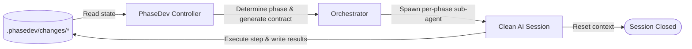

# ⚙️ PhaseDev AI Framework

[](https://bun.sh)
[](https://www.typescriptlang.org/)
[](https://opensource.org/licenses/MIT)

**PhaseDev AI Framework** is a state-driven, gated framework for autonomous AI software engineering. It coordinates AI agents through strict, isolated development phases by saving the process state directly in your project workspace rather than relying on unstable LLM chat histories.

The intended way to use PhaseDev is through the bundled **orchestrator skill**: your main agent becomes a thin flow controller that drives the `phasedev` CLI, spawns a dedicated sub-agent for each phase in a clean context, and stops only at human approval gates. A manual mode exists for driving the loop yourself, but the orchestrator is the point — it executes the whole flow end to end.

> [!IMPORTANT]
> **Take control of your AI Agents.** Long chat histories lead to *Context Drift* (agents forgetting instructions), *Token Bloat* (skyrocketing API costs), and code regression. PhaseDev AI Framework solves this by splitting work into atomic phases, resetting the agent's context window on every step, and using the workspace files as the single source of truth.

---

## ⚙️ How It Works

PhaseDev implements a strict phase state machine. In each iteration, the controller analyzes the files inside the active change directory (`.phasedev/changes/<change-name>`) to determine the current phase and prints the exact contract/prompt for that phase; the orchestrator hands that contract to a fresh sub-agent, which executes the step and writes the results back into the workspace.



Several unfinished changes may coexist under `.phasedev/changes/`. Every change-scoped command accepts `--change <name>`; when it is omitted and exactly one change exists, that change is used. With several changes and no `--change`, commands refuse and list the available names.

### The Phases of PhaseDev:
1. **Phase 1. Change Intake**: Write `prd.md` (Product Requirements) & `execution_contract.md` (Execution Contract). *Requires human approval.*
2. **Phase 2. Code Research**: Automatically collect codebase facts into `research_facts.md`.
3. **Phase 3. Technical Design**: Propose technical architecture in `architecture/design.md`. *Requires human approval.*
4. **Phase 4. Iteration Planning**: Break down implementation into atomic tasks in `iteration_plan.md`. *Requires human approval.*
5. **Phase 5. Implementation**: Code and run checks iteration-by-iteration.
6. **Phase 6A. Iteration Validation**: Review the code against iteration-specific tests.
7. **Phase 6B. Final Validation**: Verify the entire changeset against PRD success criteria.
8. **Phase 6R. Repair Loop**: If validation fails, fix findings until clean (bounded by `maxRepairCycles`).
9. **Phase 7. Archive**: Move changes to archive and generate delta specifications.

### Phase name reference

| Internal name | CLI / prompt name | Legacy config name |
|---|---|---|
| `change_intake` | Change Intake | `setup` |
| `code_research` | Code Research | `research` |
| `technical_design` | Technical Design | `design` |
| `iteration_planning` | Iteration Planning | `plan` |
| `implementation` | Implementation | `implementation` |
| `iteration_validation` | Iteration Validation | `phase_validation` |
| `final_validation` | Final Validation | `final_validation` |
| `finding_repair` | Finding Repair | `repair` |
| `archive` | Archive | `archive` |

---

## 📦 Installation

### 1. Install the global `phasedev` command

PhaseDev requires [Bun](https://bun.sh) — the CLI entrypoint (`src/cli.ts`) runs directly as a
Bun script, there is no compiled `dist/` build. Clone the repository, install dependencies, and
link the `phasedev` binary onto your `PATH`:

```bash
git clone https://github.com/your-username/phasedev.git
cd phasedev
bun install
bun link
```

`bun link` registers this repo as the global `phasedev` package and symlinks it into
`~/.bun/bin/phasedev`, which `bun` puts on your `PATH`. Verify it:

```bash
phasedev version
phasedev help
```

Because the link points at the cloned repo, `git pull` in the framework repo updates the global
command in place. To remove the link later, run `bun unlink` from this directory.

### 2. Add the orchestrator skill to a working project (Claude Code example)

The repo ships an agent skill at [`skills/phasedev-orchestrator/`](skills/phasedev-orchestrator/)
(`SKILL.md` plus harness configs under `agents/`). It turns the main agent into a thin flow
controller that drives the `phasedev` CLI and spawns a dedicated sub-agent per phase.

For Claude Code, symlink the skill directory into the working project's `.claude/skills/`:

```bash
cd /path/to/your-project
mkdir -p .claude/skills
ln -s /absolute/path/to/phasedev/skills/phasedev-orchestrator .claude/skills/phasedev-orchestrator
```

Or make it available in every project by linking into your user-level skills directory instead:

```bash
mkdir -p ~/.claude/skills
ln -s /absolute/path/to/phasedev/skills/phasedev-orchestrator ~/.claude/skills/phasedev-orchestrator
```

A symlink (rather than a copy) keeps the skill in sync with the framework: `git pull` in the
PhaseDev repo updates both the CLI and the orchestrator contract at once. Verify the skill is
visible by asking the agent to list its skills.

#### Project-specific orchestrator rules (optional)

You can tailor the orchestrator per project by adding a dedicated section to the working
project's system instruction file (`CLAUDE.md` / `AGENTS.md`). Project instructions take
precedence over the skill, so this is the supported way to override or extend the orchestrator's
defaults — e.g. mandate TDD, or pin a fixed sub-agent set for the validation phases. Example:

````markdown
## PhaseDev AI Framework (orchestrator only)

The rules in this section apply **only** while the `phasedev-orchestrator` skill is running, and
**only the orchestrator** executes them. They take **priority over the `phasedev-orchestrator`
skill's own instructions**: where a rule here duplicates or conflicts with the skill, this
section wins. In particular, for the validation phases below the sub-agent set is **fixed** as
described here — this overrides the skill's "dynamic sub-agent count" / "no phase→agent-count
table" rules for those phases only.

### TDD

- Development through the orchestrator is **always** test-driven (TDD): tests come before
  implementation code, in every iteration. This binds the planning and coding phases —
  `iteration_planning` plans the work test-first, and `implementation` (and `finding_repair`,
  which writes code the same way) writes tests before the implementation. The
  `iteration_validation` and `final_validation` phases are unrelated to TDD — they check
  finished work, not develop it.

### Iteration validation phase (`iteration_validation`)

For each iteration's `iteration_validation` phase, spawn two sub-agents:

1. **Requirements check** — verifies the implementation matches the assigned task: everything
   the iteration plan / contract requires is actually done.
2. **Code review** — reads the `dev-core` skill (and `fsd-2-1-architect` for frontend work),
   then performs a careful code review of the iteration's changes.

### Final validation phase (`final_validation`)

For the `final_validation` phase (before archive), spawn:

1. **Plan-completion check** — verifies the whole change is correctly finished: everything
   planned is done.
2. **Code review** — performs a code review and **must** use the `dev-core` skill (and
   `fsd-2-1-architect` for frontend work).
3. **Security review** — runs via the custom `sp-security-reviewer` agent.
4. **Visual / UX tester (only when the change introduces visual changes on the site)** — acts
   as a QA tester: verifies against the plan that the functionality works correctly from the
   user's perspective on the site, evaluates UI and UX quality, and raises remarks — including
   remarks not directly tied to the current change.
````

The skill names in the example (`dev-core`, `fsd-2-1-architect`, `sp-security-reviewer`) are
project-specific — substitute the skills and custom agents available in your project.

### 3. Initialize PhaseDev in the working project

From the working project's root:

```bash
phasedev init-project
```

This creates `.phasedev/changes/`, `.phasedev/changes/archive/`, `.phasedev/specs/`,
`.phasedev/logs/`, and `.phasedev/config.yaml`. It is idempotent and does not create an active
change folder.

---

## 🚀 Quick Start

### Orchestrated mode (recommended)

After installation, start the flow from the working project's root by invoking the skill with a
goal:

```
$phasedev-orchestrator <goal description>
```

The orchestrator does everything itself: creates the change, walks it through every phase with a
dedicated sub-agent per step, validates and advances between phases, runs the repair loop on
findings, and archives the finished change. It stops only where a human is required — approval
gates (PRD/contract, design, iteration plan; unless `autoApprove` is on) and unrecoverable
blockers. Give feedback at any stop point in plain words; the orchestrator classifies it
(implementation defect vs scope change) and routes it through the framework's feedback contract.

With no goal, the orchestrator resumes from the current PhaseDev state — safe to restart at any
time, because all state lives in `.phasedev/`, not in the chat.

### Manual mode

For driving the loop yourself (debugging, CI, or non-agent use), run the same commands the
orchestrator runs. All commands run from the working project's root.

1. Create a change:
   ```bash
   phasedev create-change my-change
   ```
2. Print the context-only init handshake for the agent (no file changes):
   ```bash
   phasedev init
   ```
3. Get the contract for the current phase, feed it to your AI model, then validate and advance:
   ```bash
   phasedev phase
   phasedev check
   phasedev advance
   ```

Repeat `phase` / `check` / `advance` until the change is archived. At approval gates, review the
artifact and record the decision with `phasedev approve <file> --by <name>` (or enable
`autoApprove` — see Configuration). Pass `--change <name>` when several unfinished changes exist.

> **Note:** `phasedev next` is deprecated — use `phasedev phase` and `phasedev advance` instead.

---

## 📋 Commands

`phasedev help` prints the full, current reference with side effects per command. All commands
run against the current directory's `.phasedev/` (run them from the working project's root; a
`--project-path <path>` / `-p` option exists to target another directory). Every change-scoped
command additionally accepts `--change <name>`, and the global `--json` flag works everywhere.

### Project Setup
| Command | Description |
|---------|-------------|
| `phasedev init-project` | Create `.phasedev` workspace directories and `config.yaml` (idempotent) |
| `phasedev init` | Print the context-only handshake prompt (no file changes) |
| `phasedev create-change <name> [--task <text>]` | Create a new change directory and initialize flow state; refuses duplicate names |

### Phase Flow
| Command | Description |
|---------|-------------|
| `phasedev phase [--config <path>]` | Resolve current flow state and print the phase contract (read-only) |
| `phasedev check [--phase <phase>]` | Validate current phase state (read-only) |
| `phasedev advance [--config <path>]` | Validate and transition to the next phase; refuses on invalid artifacts, pending approvals, blocked archive, or (with `requireIterationCommit`) an uncommitted working tree at a passing validation exit |
| `phasedev feedback` | Print the user-feedback processing contract (classify defect vs scope change; read-only) |
| `phasedev check-validation --scope iteration --iteration-id <N>` | Validate iteration validation findings |
| `phasedev check-validation --scope final` | Validate final validation findings |
| `phasedev check-archive --archive-path <path>` | Validate completed archive state and delta specs |
| `phasedev reopen <design\|plan>` | Reopen an approved design or plan phase for revision (resets approval and rolls `state.json` back) |
| `phasedev sync-state [--change <name>]` | Non-destructively roll `state.json` back to the artifact-derived phase when they disagree (artifacts untouched) |
| `phasedev next` | **Deprecated** — use `phase` and `advance` instead |

### Artifact Management
| Command | Description |
|---------|-------------|
| `phasedev approve <file> [--by <name>]` | Set `approved: true` in YAML frontmatter |
| `phasedev validate-artifact <file>` | Validate an artifact file without modifying flow state |
| `phasedev set-iteration-status <id> <status> [--file <path>]` | Update iteration status (`x`/`~`/space or `completed`/`in_progress`/`not_started`) |
| `phasedev add-finding [F<number>] <title> <severity> --required-fix <text> [--class <class>] [--iteration <iteration>] [--file <path>]` | Add a finding to `validation_findings.md`; the `F<number>` ID is allocated automatically unless passed explicitly; creates the file when missing and keeps the verdict consistent |
| `phasedev resolve-finding <id> --resolution <text> [--file <path>]` | Mark a finding as resolved with repair evidence |
| `phasedev reopen-finding <id> --evidence <text> [--file <path>]` | Reopen a resolved finding with new concrete evidence |
| `phasedev set-verdict <verdict> [--file <path>]` | Record the validation verdict (`ready` \| `ready_with_risks` \| `repair_required` \| `repaired`), validated against the current rows |

### Flow Status & Info
| Command | Description |
|---------|-------------|
| `phasedev status` | Print current flow summary (change, phase, route, artifacts, findings) |
| `phasedev list [--archived]` | List unfinished changes; with `--archived`, archived ones too |
| `phasedev changes` | Alias for `list` |
| `phasedev log [--tail N]` | View flow log entries (`.phasedev/logs/ralph-log.jsonl`) |
| `phasedev config <key>` | Read a config key |
| `phasedev config set <key> <value> [--string]` | Write a config key (auto-coerces booleans/numbers unless `--string` forces raw string storage; echoes the stored type) |

### Meta
| Command | Description |
|---------|-------------|
| `phasedev help` | Print the full command reference (`--help`, `-h`) |
| `phasedev version` | Print framework version (`--version`, `-V`) |
| `phasedev reset-change [--yes\|--force]` | Discard the active change (move to `.trash`). Destroys all change artifacts — NOT a state reset; use `sync-state` for that |

---

## 🩹 Feedback & Recovery

- **User feedback** on a change goes through `phasedev feedback`: it prints a contract that tells
  the agent to record implementation defects via `add-finding`/`reopen-finding`, or — for scope
  changes — to walk the artifact chain (`prd.md` → `execution_contract.md` → `research_facts.md`
  → `architecture/design.md` → `iteration_plan.md`), update only what is affected, reset
  `approved: false` on changed artifacts, and finish with `phasedev sync-state`. When running
  through the orchestrator, just describe the feedback at any stop point — it handles this flow
  for you.
- **`sync-state`** is the non-destructive fix when `state.json` and the artifacts disagree on the
  current phase (e.g. after a scope change unapproved an upstream artifact). It rolls
  `activePhase` back to the artifact-derived phase and never touches artifacts.
- **`reopen design|plan`** is the targeted rollback for revising an already-approved design or
  iteration plan.
- **`reset-change`** is destructive: it moves the entire change directory to
  `.phasedev/changes/.trash`. Never use it to fix a state/phase mismatch.

---

## 🤖 Machine-readable output

Every command accepts a global `--json` flag. Instead of human-readable text, it prints a single
JSON object to stdout:

```jsonc
{ "ok": true, "kind": "phase", "phase": "implementation", "message": "...", "issues": [], "data": {} }
```

`ok`, `kind` are always present; `phase`, `message`, `issues`, `data` are populated when relevant
to the command. The process exit code mirrors `ok` (`0` when `true`, `1` when `false`). Use
`--json` when driving PhaseDev from another agent, script, or CI step instead of parsing the
human-readable text output.

---

## 🛠️ Configuration

Configure phases and flow flags in `.phasedev/config.yaml`:

```yaml
phases:
  change_intake:
    skills:
      routers: []
      main: []
      additional: []
  # ... other phases

# Root-level flow flags
runArchiveStage: true
autoApprove: false
maxIterations: 10
maxRepairCycles: 3
blockingSeverity: must_fix
requireIterationCommit: true
```

- `runArchiveStage: true` (default) makes `advance` perform the archive mutation (move the change
  to `.phasedev/changes/archive/<date>-<name>` and start the Archive phase) when the flow reaches
  `archive_ready`.
- `autoApprove: true` makes `phasedev advance` set `approved: true` and
  `approved_by: "PhaseDev autoApprove"` on valid approval artifacts after controller validation
  has already routed to an approval gate. With `autoApprove: false` (default), `advance` stops at
  each approval gate for human review.
- `maxRepairCycles` (default 3) is enforced by the controller: `advance` refuses to start another
  finding-repair cycle beyond the limit, so a broken change cannot loop forever. Resolve the
  findings manually or raise the limit.
- `maxIterations` is advisory only: the controller does not read or enforce it. It exists for an
  external loop/runner to read via `phasedev config maxIterations` and decide when to stop
  iterating.
- `blockingSeverity` (`must_fix` | `recommended` | `nit`, default `must_fix`) sets the minimal
  validation-finding severity that blocks the flow: it routes to `finding_repair`, gates phase
  exits, and constrains which verdicts are reachable. `recommended` also blocks RECOMMENDED
  findings; `nit` blocks everything, so `ready_with_risks` becomes unreachable. Security-class
  findings are always MUST-FIX and always block, regardless of this setting.
- `requireIterationCommit: true` (default) adds a clean-tree gate to validation exits: `advance`
  out of a passing `iteration_validation` (or `final_validation` before archive) refuses while
  uncommitted changes exist outside `.phasedev/**`, and prints a suggested commit message. The
  agent is expected to commit — the controller never mutates git itself. The gate is silently
  skipped in non-git projects. Commit boundaries are recorded in a controller-only
  `.commit-log.json` in the change directory, and validators see per-iteration boundary diffs
  instead of the whole accumulated working tree.

Per-phase `skills` lists (`routers` / `main` / `additional`) declare which external agent skills a
phase prompt may authorize; they are injected into executable `phasedev phase` prompts only. An
unrecognized key under `phases:` (or the legacy `stages:`) is a hard error — `phasedev` refuses to
load a config with a typo'd phase name instead of silently dropping its skill configuration.

---

## 🤝 Contributing & Extensions

PhaseDev is designed for extension. You can add custom execution scripts and guidelines under `src/features` or configure custom phase routers in `config.yaml` to dynamically load domain skills.

License: MIT
