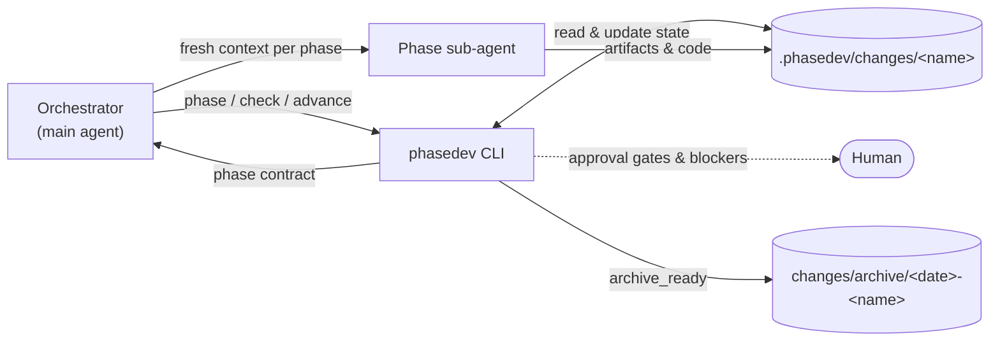

# ⚙️ PhaseDev AI Framework

[](https://bun.sh)
[](https://www.typescriptlang.org/)
[](https://opensource.org/licenses/MIT)

**PhaseDev** is a state-driven flow controller for autonomous AI software engineering. It splits a change into strict, isolated phases, stores all flow state in your project's workspace (`.phasedev/`), and prints an exact contract for each phase. An orchestrator agent drives the CLI and spawns a dedicated sub-agent with a fresh context per phase — so long chat histories, context drift, and token bloat stop being the source of truth.

> [!IMPORTANT]
> The workspace files are the single source of truth. Kill the session at any point and restart — the flow resumes exactly where it stopped.

---

## ⚙️ How It Works

PhaseDev is a phase state machine. The controller (`phasedev` CLI) derives the current phase from the files in the active change directory, prints that phase's contract, and validates the results before allowing a transition. The orchestrator skill turns your main agent into a thin loop around three commands — `phase` → `check` → `advance` — delegating every phase's actual work to a fresh sub-agent.



### Standard phases

1. **Change Intake** — write `prd.md` + `execution_contract.md`. *Human approval gate.*
2. **Code Research** — collect codebase facts into `research_facts.md`.
3. **Technical Design** — propose `architecture/design.md`. *Human approval gate.*
4. **Iteration Planning** — break work into atomic iterations in `iteration_plan.md`. *Human approval gate.*
5. **Implementation** — code and run checks, iteration by iteration.
6. **Iteration / Final Validation** — review each iteration, then the whole changeset against PRD criteria.
7. **Finding Repair** — fix validation findings until clean (bounded by `maxRepairCycles`).
8. **Archive** — move the change to `changes/archive/` and generate delta specs under `.phasedev/specs/`.

Several unfinished changes may coexist under `.phasedev/changes/`. Change-scoped commands take `--change <name>`; with exactly one change it is inferred.

---

## 🎚️ Execution Tracks

Pick the track by the size of the change:

| Track | Persistence | Flow | Fits |
|---|---|---|---|
| **Standard** | Full artifact set (`prd.md`, design, plan, findings, …) | 8 phases above | Real features; anything needing an audit trail |
| **Quick** (`create-change --quick`) | One `worklog.md` | `quick_plan → quick_implementation → quick_validation → quick_spec_revision → archive` | Small but real change that still deserves a plan and archive record |
| **Express** (skill only) | None — no `.phasedev/` writes; the git commit is the only trace | Research → plan → *confirm* → implement → review → fix loop, all in-context sub-agents | Tiny well-understood tweaks where artifacts cost more than the task |

Standard and Quick run through the `phasedev` CLI and the `phasedev-orchestrator` skill. Express is a separate skill, `express-orchestrator`, that keeps every artifact in the orchestrator's conversation instead of on disk — with a scope guard that proposes switching to Quick/Standard if the task grows.

---

## 📦 Installation

> **Requirement:** PhaseDev runs on [Bun](https://bun.sh) only — the CLI entrypoint (`src/cli.ts`) is a Bun script; there is no compiled build.

### 1. Install the global `phasedev` command

```bash
git clone https://github.com/your-username/phasedev.git
cd phasedev
bun install
bun link        # symlinks `phasedev` into ~/.bun/bin
phasedev version
```

The link points at the clone, so `git pull` updates the global command in place (`bun unlink` removes it).

### 2. Add the orchestrator skills (Claude Code example)

The repo ships two agent skills under [`skills/`](skills/): `phasedev-orchestrator` (Standard + Quick) and `express-orchestrator` (stateless track). Symlink them into a project's `.claude/skills/` — or into `~/.claude/skills/` to have them everywhere:

```bash
mkdir -p ~/.claude/skills
ln -s /absolute/path/to/phasedev/skills/phasedev-orchestrator ~/.claude/skills/phasedev-orchestrator
ln -s /absolute/path/to/phasedev/skills/express-orchestrator  ~/.claude/skills/express-orchestrator
```

Symlinks (not copies) keep the skills in sync with the CLI on `git pull`. To tailor the orchestrator per project (mandate TDD, pin reviewer sub-agents, …), add a dedicated section to the project's `CLAUDE.md` / `AGENTS.md` — project instructions take precedence over the skill.

### 3. Initialize a working project

```bash
cd /path/to/your-project
phasedev init-project
```

Creates `.phasedev/` (changes, archive, specs, logs, `config.yaml`). Idempotent.

---

## 🚀 Quick Start

### Orchestrated (recommended)

```
$phasedev-orchestrator <goal description>     # Standard or Quick — orchestrator proposes, you confirm
$express-orchestrator  <task description>     # stateless track for tiny changes
```

The orchestrator runs the whole flow itself — creates the change, drives every phase with a dedicated sub-agent, repairs findings, archives — and stops only at approval gates (unless `autoApprove` is on) and unrecoverable blockers. Describe feedback at any stop in plain words; it classifies it (defect vs scope change) and routes it through the feedback contract. Invoked with no goal, it resumes from the current `.phasedev/` state.

### Manual

The same loop the orchestrator runs, from the working project's root:

```bash
phasedev create-change my-change   # add --quick for Quick mode
phasedev phase                     # print the current phase contract → feed to your agent
phasedev check                     # validate the phase's artifacts
phasedev advance                   # transition to the next phase
```

Repeat `phase` / `check` / `advance` until archived. At approval gates, review the artifact and run `phasedev approve <file> --by <name>`.

> `phasedev next` is deprecated — use `phase` + `advance`.

---

## 📋 Commands

`phasedev help` prints the full, current reference with side effects per command. Global flags: `--json` (machine-readable envelope, exit code mirrors `ok`), `--project-path <path>`, `--change <name>`.

| Area | Commands |
|---|---|
| Setup | `init-project`, `init` (context handshake, no file changes), `create-change <name> [--task <text>] [--quick]` |
| Flow loop | `phase`, `check [--phase <p>]`, `advance`, `feedback` |
| Approvals & artifacts | `approve <file> [--by <name>]`, `validate-artifact <file>`, `set-iteration-status <id> <status>` |
| Findings | `add-finding <title> <severity> --required-fix <text>`, `resolve-finding <id> --resolution <text>`, `reopen-finding <id> --evidence <text>`, `set-verdict <verdict>` |
| Validation checks | `check-validation --scope iteration --iteration-id <N>`, `check-validation --scope final`, `check-archive --archive-path <path>` |
| Recovery | `sync-state`, `reopen <design\|plan>`, `reset-change --yes` (destructive) |
| Info | `status`, `list [--archived]`, `log [--tail N]`, `config <key>`, `config set <key> <value>`, `version` |

---

## 🩹 Feedback & Recovery

- **`phasedev feedback`** prints the contract for processing user feedback: implementation defects go through `add-finding` / `reopen-finding`; scope changes walk the artifact chain (`prd.md` → … → `iteration_plan.md`), reset `approved: false` on what changed, and finish with `sync-state`.
- **`sync-state`** — non-destructive fix when `state.json` and artifacts disagree on the phase; rolls state back, never touches artifacts.
- **`reopen design|plan`** — targeted rollback to revise an already-approved design or plan.
- **`reset-change`** — destructive: moves the whole change to `.phasedev/changes/.trash`. Never use it for a state mismatch.

---

## 🛠️ Configuration

`.phasedev/config.yaml` — flow flags plus optional per-phase skill policy:

```yaml
phases:
  change_intake:
    skills: { routers: [], main: [], additional: [] }
  # ... other phases

runArchiveStage: true        # advance performs the archive mutation at archive_ready
autoApprove: false           # true: advance auto-approves valid gate artifacts
maxRepairCycles: 3           # hard cap on finding_repair loops
maxIterations: 10            # advisory only — for external runners
blockingSeverity: must_fix   # must_fix | recommended | nit — minimal severity that blocks the flow
requireIterationCommit: true # clean-git-tree gate on passing validation exits (agent commits, controller never touches git)
```

Per-phase `skills` lists declare which external agent skills a phase prompt may authorize; they are injected into `phasedev phase` prompts only. A typo'd phase name under `phases:` is a hard error, not a silent drop. Security-class findings always block regardless of `blockingSeverity`.

---

License: MIT
