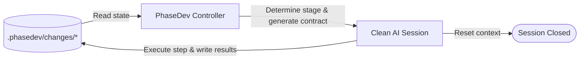

# ⚙️ PhaseDev AI Framework

[](https://bun.sh)
[](https://www.typescriptlang.org/)
[](https://opensource.org/licenses/MIT)

<p align="center">
  
</p>

**PhaseDev AI Framework** is a state-driven, gated framework for autonomous AI software engineering. It coordinates AI agents through strict, isolated development phases by saving the process state directly in your project workspace rather than relying on unstable LLM chat histories.

> [!IMPORTANT]
> **Take control of your AI Agents.** Long chat histories lead to *Context Drift* (agents forgetting instructions), *Token Bloat* (skyrocketing API costs), and code regression. PhaseDev AI Framework solves this by splitting work into atomic stages, resetting the agent's context window on every step, and using the workspace files as the single source of truth.

---

## ⚙️ How It Works

PhaseDev implements a strict phase state machine. In each iteration, it analyzes the files inside the active change directory (`.phasedev/changes/<change-name>`) to determine the current stage, prints the exact contract/prompt for that stage, executes the agent in a clean session, and records the results.



### The Stages of PhaseDev:
1. **1. Change Intake**: Write `prd.md` (Product Requirements) & `execution_contract.md` (Execution Contract). *Requires human approval.*
2. **2. Code Research**: Automatically collect codebase facts into `research_facts.md`.
3. **3. Technical Design**: Propose technical architecture in `architecture/design.md`. *Requires human approval.*
4. **4. Iteration Planning**: Break down implementation into atomic tasks in `iteration_plan.md`. *Requires human approval.*
5. **4. Implementation**: Code and run checks phase-by-phase.
6. **5A. Phase Validation**: Review the code against phase-specific tests.
7. **5B. Final Validation**: Verify the entire changeset against PRD success criteria.
8. **5R. Repair Loop**: If validation fails, automatically fix findings until clean.
9. **6. Archive**: Move changes to archive and generate delta specifications.

---

## 🚀 Quick Start (Manual Mode)

### 1. Installation
Clone this repository and install the dependencies:
```bash
git clone https://github.com/your-username/phasedev.git
cd phasedev
npm install
```

### 2. Initialize PhaseDev in a Target Project
Create the PhaseDev workspace structure and project-local config in your target project:
```bash
phasedev init-project --project-path /absolute/path/to/your-project
```
This creates `.phasedev/changes/`, `.phasedev/changes/archive/`, `.phasedev/specs/`, `.phasedev/logs/`, and `.phasedev/config.yaml`. It does not create an active change folder.

### 3. Run the Init Handshake
Before sending executable stage prompts to an AI agent, print the context-only init handshake:
```bash
phasedev init --project-path /absolute/path/to/your-project
```
This command does not modify files. It only tells the agent to wait for the complete `phasedev next` controller output.

### 4. Run Next Stage Prompt
Get the contract for the current stage to feed into your AI model:
```bash
phasedev next --project-path /absolute/path/to/your-project
```

---

## 🤖 Automated Loop: PhaseDev Runner
The **PhaseDev Runner** (runner) automates the manual cycle by launching isolated agent runs, executing stage prompts, logging answers, and monitoring progress.

### Run automation:
```bash
npm run phasedev:run -- --project-path /absolute/path/to/your-project
```

### Real-time Telegram Notifications
PhaseDev supports sending console outputs and loop milestones directly to your Telegram channel. 
Copy `.env.example` to `.env` and fill in:
```env
TELEGRAM_BOT_TOKEN=your_bot_token
TELEGRAM_CHAT_ID=your_chat_id
```

Configure `loop.notifications.telegram.enabled: true` in your `config.yaml`.

---

## 🛠️ Configuration

Configure stages, model presets, sandbox security, and loop thresholds in `config.yaml`:

```yaml
codex:
  default:
    model: gpt-5.4
    reasoningEffort: high
  sandboxMode: workspace-write # options: workspace-write, danger-full-access
  approvalPolicy: never

loop:
  maxIterations: 10
  logDir: .phasedev/logs
  autoApprove: false # runner-only: auto-approve valid PRD/design/plan approval gates
  notifications:
    telegram:
      enabled: false
```

`loop.autoApprove: true` is only used by the automated runner. It sets `approved: true` and
`approved_by: "PhaseDev Runner"` on valid approval artifacts after controller validation has
already routed to an approval gate. Manual `phasedev next` still stops for human review.

---

## 🤝 Contributing & Extensions

PhaseDev is designed for extension. You can add custom execution scripts and guidelines under `src/features` or configure custom stage routers in `config.yaml` to dynamically load domain skills.

License: MIT
