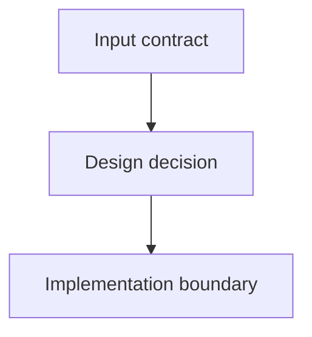

Stage 2. Design.

Stage contract: prepare an approvable visual-first architecture package based on requirements and research facts.

{{skill_policy}}

Input artifacts:
- PRD intent, requirements, and success criteria: [prd.md]({{prd_path}})
- Test command rules: [rules.md]({{rules_path}})
- Research results: [research_facts.md]({{research_path}})

Required output artifact:
- [architecture/design.md]({{design_path}})

Use the Artifact Build Contract below as the only source of structure for `architecture/design.md`.

{{design_artifact_contract}}

`architecture/design.md` is the required design-stage entry point, the only design approval gate, and the architecture package entrypoint/index.

Additional architecture files inside `architecture/` are allowed and expected for any non-trivial design. Examples: `data-flow.md`, `api-contracts.md`, `ui-architecture.md`, `migration-plan.md`, `persistence.md`, `runtime-layout.md`, `validation.md`.

Small/single-file design:
- If the change is small, touches 1-3 tightly related areas, and the whole design reads compactly, it may stay entirely in `architecture/design.md`.
- Even a small/single-file design must have a compact visual review surface near the top.
- For small/single-file design, list only `architecture/design.md` in `Architecture Package Map`.

Decomposition rules:
- `architecture/design.md` target size: up to 120 lines; hard guidance: do not bloat it beyond 180 lines.
- If the design covers 4+ material areas, create a linked subdocument for each major area.
- If an individual section becomes longer than 40 lines, move the details into a linked subdocument.
- If there are separate contracts, data flow, API surface, UI flow, persistence, migration, security boundary, validation, or runtime ownership concerns, prefer a separate `architecture/*.md`.
- Linked subdocument names must be short, kebab-case, and reflect the area: `command-surface.md`, `runtime-layout.md`, `parser-config.md`, `persistence.md`, `backend-boundaries.md`, `frontend-boundaries.md`, `validation.md`.
- Do not split artificially: a subdocument is needed only when it genuinely improves human review.
- Do not duplicate large prose fragments between `design.md` and subdocuments; `design.md` summarizes and links, subdocuments hold details.

Requirements for `architecture/design.md`:
- include a concise summary of the solution and exactly what the user approves in `## Executive Summary`;
- explicitly connect the design direction to `Intent` from [prd.md]({{prd_path}}): why the change is needed, target state, and risk boundaries in `## Executive Summary` or `## Key Design Decisions`;
- include an explicit traceability table or list showing which design decisions cover each `R#` requirement and each `SC#` success criterion from the PRD in `## Traceability Mapping`;
- do not introduce design work that is not grounded in `Target state`, `R#`, `SC#`, or `Risk boundaries` from the PRD;
- include a compact visual review surface near the top;
- include the required `Architecture Package Map` table in `## Architecture Package Map`;
- include a list of key design decisions grouped by meaning in `## Key Design Decisions`;
- include open risks and questions in `## Risks & Open Questions`;
- link every additional architecture file if any are created.

`Architecture Package Map` format:

| File | Purpose | Visual content | Review priority |
| --- | --- | --- | --- |
| `architecture/design.md` | Entry point and approval summary | review table, package map, top-level diagram | high |
| `architecture/example.md` | Detailed concern, if needed | Mermaid/table/tree diagram | medium |

`Architecture Package Map` is an index of files in the approvable design package, not a component implementation map.
If implementation component mapping is needed for review, keep it in `## Key Design Decisions` or a linked architecture subdocument.

All referenced files inside `architecture/` are considered part of the approved design if they are explicitly listed in the approved `architecture/design.md`.

The controller checks approval only on `architecture/design.md`; separate approval for architecture subdocuments is not required.

## Visual-first policy

Human reviewers must quickly understand what will change and how it is planned. Write the design as a reviewable architecture map, not as a long prose essay.

Visual-first formatting rules:
- For a non-trivial design package, use at least one Mermaid diagram.
- Use schemas, diagrams, tables, matrix views, and directory trees wherever they make human review easier.
- Mermaid is suitable for `flowchart`, `sequenceDiagram`, `classDiagram`, `erDiagram`, `stateDiagram`, and component/data-flow diagrams.
- Use tables for contracts, public interfaces, risks, ownership, decisions, alternatives, and validation mapping.
- Use directory trees for planned file/module layout.
- A diagram must explain real changes or planned architecture; do not add decorative diagrams without review value.
- If the design affects runtime flow, dependency direction, persistence, API contract, UI states, or validation path, show that with a diagram.
- Every linked subdocument must start with purpose, then a diagram/table/tree review surface, then decisions/contracts/details.
- Do not bury important risks, changed contracts, or ownership boundaries deep in prose; show them near the top in a table/callout.

Example Mermaid syntax when it fits the content:



For other diagram types, use Mermaid blocks with `sequenceDiagram`, `classDiagram`, `erDiagram`, or `stateDiagram` when they explain the change better.

## Artifact allowlist

Allowed persistent artifacts for this stage:
- `architecture/design.md`
- linked files inside `architecture/`, only when they are referenced from `architecture/design.md`

Constraints:
- do not change production code at this stage;
- the AI agent must not change `approved: false` to `approved: true`; approval is performed by the user.

## Human Review Formatting Policy

`architecture/design.md` is the approval artifact and index for the whole architecture package, so format it for quick human review.

Formatting rules:
- YAML frontmatter remains first in the file.
- Choose structure based on the concrete change content.
- The first visible part of the document must quickly explain the technical direction the user is approving.
- Immediately after the title/intro, add a compact visual review surface. This is not a fixed section; it is 2-5 callouts, bullets, or table rows with the most important approval information.
- In the compact visual review surface, use semantic emoji markers when they add signal: 📌 approval scope, 🚫 out of scope, ✅ key decision/success, ⚠️ risk/reviewer attention, 🧪 validation, 🔒 security/secret boundary.
- Do not leave an approval artifact as an ordinary wall of markdown when semantic visual markers, diagrams, tables, callouts, or grouping clearly speed up review.
- Use one primary human language for artifact prose; keep code identifiers, file paths, commands, and source terms in their original form.
- If a question affects the approval artifact, ask the user and stop until the answer.
- Do not write pending open questions into `architecture/design.md` as a substitute for asking the user.
- Do not encode assumptions or deferred decisions as separate design concepts unless they are grounded in approved PRD rows.
- Do not accept a technical direction that changes `Target state`, `R#` requirements, `SC#` success criteria, `Evidence` types, or `Risk boundaries` from the PRD. If design requires that kind of change, stop and ask the user to realign the PRD.
- Do not create empty, decorative, or artificial sections such as risks/alternatives/security when they have no material content.
- Use headings, short paragraphs, bullets, tables, blockquotes, and bold where they help readability.
- If a list grows beyond 7 items, group it by meaningful categories instead of using one long flat list.
- Use callouts for approval scope, reviewer attention, changed contracts, risks, accepted assumptions, and deferred decisions when they exist.
- If there are material risks, tradeoffs, accepted assumptions, changed contracts, or reviewer attention points, make them visually noticeable near the top.
- Reflect `Risk boundaries` in design decisions, validation mapping, and rollout/rollback considerations where relevant.
- If design needs an assumption or deferred decision that is not already grounded in the PRD tables, stop and realign the PRD instead of adding a new approval concept.
- Emoji may be used as semantic visual markers when they help scan the document.
- Do not use emoji in YAML frontmatter.
- Do not use emoji in commands, file paths, code blocks, or required machine-readable labels.
- In `architecture/design.md`, preserve all machine-readable approval frontmatter elements and explicitly list linked architecture files if they are part of the approved design.

## Completion self-check

Before completing the stage, verify:
- `architecture/design.md` is not a huge design dump: the target size is respected or there is a clear reason to remain single-file.
- If `architecture/design.md` approaches 180 lines, details have been moved to linked subdocuments.
- All linked subdocuments are listed in `Architecture Package Map` and explicitly linked from `architecture/design.md`.
- A non-trivial design package has at least one Mermaid diagram.
- Diagrams/tables show what will change and how it is planned; they do not merely decorate the document.
- Long prose does not duplicate linked subdocuments.
- Every linked subdocument starts with purpose and a visual review surface.
- Design does not diverge from PRD intent, target state, `R#`, `SC#`, evidence types, or risk boundaries.

Then immediately validate the new design artifact before completing the stage:

```bash
{{self_check_command}}
```

If the check fails, fix the reported artifact issues in this same stage, then rerun the same command. Repeat until it exits successfully. Do not ask the user to approve `architecture/design.md` until this self-check passes.

Stage completion:
- After writing the architecture package, run the artifact self-check, fix any reported issues, and stop only after the self-check passes.
- Tell the user they need to review `architecture/design.md`, set `approved: true`, and then run `flow next`.
