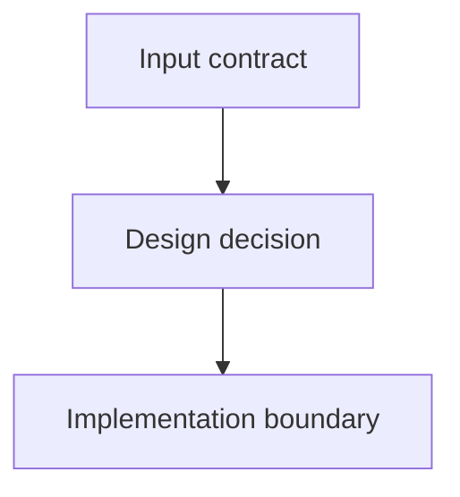

Этап 2. Design.

Stage contract: подготовить утверждаемый visual-first architecture package на основе требований и research facts.

{{skill_policy}}

Входные артефакты:
- Требования PRD и ADLC-style Intent Card: [prd.md]({{prd_path}})
- Правила разработки: [rules.md]({{rules_path}})
- Результаты исследования: [research_facts.md]({{research_path}})

Обязательный выходной артефакт:
- [architecture/design.md]({{design_path}})

`architecture/design.md` является обязательной точкой входа для design stage, единственным design approval gate и architecture package entrypoint / index.

Дополнительные architecture files внутри `architecture/` разрешены и ожидаются для любого нетривиального дизайна. Примеры: `data-flow.md`, `api-contracts.md`, `ui-architecture.md`, `migration-plan.md`, `persistence.md`, `runtime-layout.md`, `validation.md`.

Small/single-file design:
- Если change маленький, затрагивает 1-3 tightly related areas и весь дизайн читается компактно, можно оставить только `architecture/design.md`.
- Даже small/single-file design должен иметь compact visual review surface near the top.
- Для small/single-file design в `Architecture Package Map` укажите только `architecture/design.md`.

Decomposition rules:
- `architecture/design.md` target size: до 120 строк; hard guidance: не раздувайте выше 180 строк.
- Если дизайн покрывает 4+ material areas, создайте linked subdocument для каждой крупной области.
- Если отдельный раздел становится длиннее 40 строк, вынесите детали в linked subdocument.
- Если есть отдельные contracts, data flow, API surface, UI flow, persistence, migration, security boundary, validation или runtime ownership, предпочитайте отдельный `architecture/*.md`.
- Имена linked subdocuments должны быть короткими, kebab-case и отражать область: `command-surface.md`, `runtime-layout.md`, `parser-config.md`, `persistence.md`, `backend-boundaries.md`, `frontend-boundaries.md`, `validation.md`.
- Не дробите искусственно: subdocument нужен только если он реально улучшает human review.
- Не дублируйте большие фрагменты prose между `design.md` и subdocuments; `design.md` summarises and links, subdocuments hold details.

Требования к `architecture/design.md`:
- YAML frontmatter:
---
approved: false
approved_by: ""
date: {{date}}
---
- краткое summary решения и что именно пользователь approve-ит;
- явная связь design direction с ADLC-style `Intent Card` из [prd.md]({{prd_path}}): user/business intent, generation target, resolution signal, decision deadline и risk envelope;
- явное отражение `Accepted Assumptions` и `Deferred Decisions` из PRD: assumptions становятся design constraints, deferred decisions должны быть либо решены в design, либо явно оставлены как approved planning/implementation boundary;
- compact visual review surface near the top;
- обязательная таблица `Architecture Package Map`;
- список key design decisions, сгруппированный по смыслу;
- открытые риски и вопросы;
- ссылки на все дополнительные architecture files, если они созданы.

Формат `Architecture Package Map`:

| File | Purpose | Visual content | Review priority |
| --- | --- | --- | --- |
| `architecture/design.md` | Entry point and approval summary | review table, package map, top-level diagram | high |
| `architecture/example.md` | Detailed concern, if needed | Mermaid/table/tree diagram | medium |

Все referenced files внутри `architecture/` считаются частью утвержденного дизайна, если они явно перечислены в approved `architecture/design.md`.

Controller проверяет approval только у `architecture/design.md`; отдельный approval для architecture subdocuments не требуется.

## Visual-first policy

Human review должен быстро понимать, что будет изменено и как это планируется. Пишите design как reviewable architecture map, а не как длинное текстовое эссе.

Правила visual-first оформления:
- Для нетривиального design package используйте минимум одну Mermaid-диаграмму.
- Максимально используйте схемы, диаграммы, tables, matrix views и directory trees для удобного human review.
- Mermaid подходит для `flowchart`, `sequenceDiagram`, `classDiagram`, `erDiagram`, `stateDiagram` и component/data-flow diagrams.
- Таблицы используйте для contracts, public interfaces, risks, ownership, decisions, alternatives и validation mapping.
- Directory trees используйте для planned file/module layout.
- Диаграмма должна объяснять реальные изменения или planned architecture; не добавляйте декоративные диаграммы без review value.
- Если design влияет на runtime flow, dependency direction, persistence, API contract, UI states или validation path, покажите это схемой.
- Любой linked subdocument должен начинаться с purpose, затем diagram/table/tree review surface, затем decisions/contracts/details.
- Не прячьте важные risks, changed contracts или ownership boundaries глубоко в prose; покажите их near the top в table/callout.

Пример Mermaid syntax, если подходит содержанию:

Для других типов схем используйте Mermaid blocks с `sequenceDiagram`, `classDiagram`, `erDiagram` или `stateDiagram`, когда это лучше объясняет change.

## Artifact allowlist

Allowed persistent artifacts for this stage:
- `architecture/design.md`
- linked files inside `architecture/`, only when they are referenced from `architecture/design.md`

Ограничения:
- не изменяйте production code на этом этапе;
- ИИ-агент не имеет права менять `approved: false` на `approved: true`; approval делает пользователь.

## Human Review Formatting Policy

`architecture/design.md` является approval artifact и index для всего architecture package, поэтому оформляйте его для быстрого human review.

Правила оформления:
- YAML frontmatter остается первым в файле.
- Структуру выбирайте по содержанию конкретного change.
- Первая видимая часть документа должна быстро объяснять, какое technical direction пользователь approve-ит.
- Сразу после title/intro добавьте compact visual review surface; это не фиксированная секция, а 2-5 callouts, bullets или table rows с самым важным для approval.
- В compact visual review surface используйте semantic emoji markers там, где они добавляют сигнал: 📌 approval scope, 🚫 out of scope, ✅ key decision/success, ⚠️ risk/reviewer attention, 🧪 validation, 🔒 security/secret boundary.
- Не оставляйте approval artifact как обычную простыню markdown, если semantic visual markers, diagrams, tables, callouts или grouping явно ускоряют review.
- Используйте один основной human language для prose artifact; code identifiers, file paths, commands и source terms оставляйте в оригинале.
- Если вопрос влияет на approval artifact, задайте его пользователю и остановитесь до ответа.
- Не записывайте pending open questions в `architecture/design.md` как замену вопросу пользователю.
- Отделяйте accepted assumptions и deferred design-stage decisions от вопросов, которые требуют ответа до approval.
- Не принимайте technical direction, который меняет `Generation target`, `Resolution signal`, scope boundaries, success criteria, accepted assumptions или `Risk envelope` из PRD; если design требует такого изменения, остановитесь и попросите пользователя пересогласовать PRD.
- Не создавайте пустые, декоративные или искусственные разделы вроде risks/alternatives/security, если там нет material content.
- Используйте headings, короткие абзацы, bullets, tables, blockquotes и bold там, где это помогает чтению.
- Если список становится длиннее 7 пунктов, сгруппируйте его по смысловым категориям вместо одного long flat list.
- Используйте callouts для approval scope, reviewer attention, changed contracts, risks, accepted assumptions и deferred decisions, если они есть.
- Если есть material risks, tradeoffs, accepted assumptions, changed contracts или reviewer attention points, сделайте их визуально заметными near the top.
- Если `Intent Card` содержит `Resolution signal`, `Decision deadline` или `Risk envelope`, отразите их влияние на design decisions, validation mapping и rollout/rollback considerations where relevant.
- Если PRD содержит `Accepted Assumptions` или `Deferred Decisions`, покажите near the top, какие design decisions зависят от них и какие проверки должны подтвердить или защитить эти условия.
- Можно использовать эмоджи как смысловые visual markers, если они помогают сканировать документ.
- не используйте эмоджи в YAML frontmatter.
- не используйте эмоджи в командах, file paths, code blocks и обязательных machine-readable labels.
- В `architecture/design.md` сохраните все machine-readable элементы approval frontmatter и явно перечислите linked architecture files, если они входят в approved design.

## Completion self-check

Перед завершением stage проверьте:
- `architecture/design.md` не является огромным design dump: target size соблюден или есть явная причина остаться single-file.
- Если `architecture/design.md` приблизился к 180 строкам, детали вынесены в linked subdocuments.
- Все linked subdocuments перечислены в `Architecture Package Map` и явно linked from `architecture/design.md`.
- Для нетривиального design package есть минимум одна Mermaid-диаграмма.
- Diagrams/tables показывают, что будет изменено и как это планируется, а не просто украшают документ.
- Long prose не дублирует linked subdocuments.
- Каждый linked subdocument начинается с purpose и visual review surface.
- Design не расходится с PRD intent, generation target, resolution signal, accepted assumptions, deferred decisions и risk envelope.

Завершение шага:
- После записи architecture package остановите работу.
- Сообщите пользователю, что нужно проверить `architecture/design.md`, установить `approved: true` и затем запустить `flow next`.
